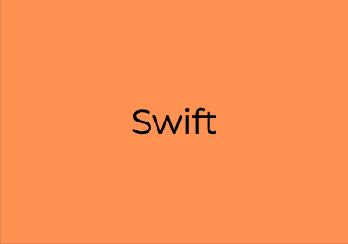
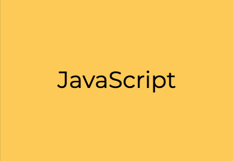
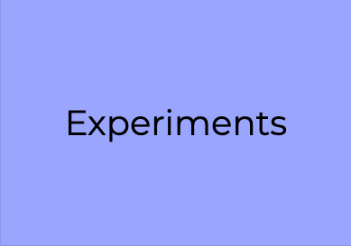
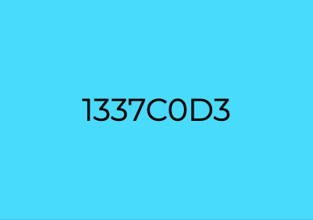
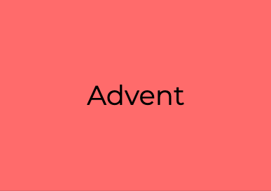

<h1 align="center">Welcome to my laboratory </h1>

## Active Directories

### Challenge Sources

- [L337C0D3](https://leetcode.com/)
- [AdventOfCode](https://adventofcode.com)
- [r/dailyprogrammer](https://www.reddit.com/r/dailyprogrammer/)
- [nand2tetris](http://www.nand2tetris.org/)
- [Project Euler](https://projecteuler.net/)

### Security Related Challenges

- [OverTheWire](http://overthewire.org/wargames/)
- [NetGarage](https://io.netgarage.org/)
- [SmashTheStack](http://smashthestack.org/)
- [MicroCorruption](https://microcorruption.com/login)
- [PicoCTF](https://picoctf.com/get_started)

##### Please feel free to write your own implementations for anything and pr it in (especially alternatives to practice problems)
